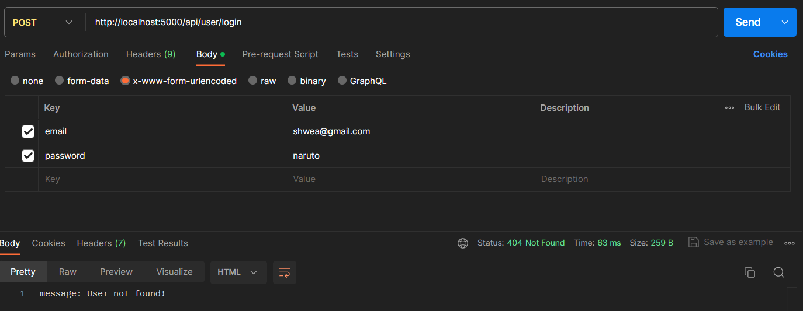

JWT -> used for ```Authorization``` (It authorizes that this particaular user has access to this particular system)

Authorization: ensuring that the user making request to the server is the same user who has been logged in during the authentication process.

authentication -> like sigin/signup, to identify user; ```who is the user?```


authorization -> to grant access; ```what all the user can do?```

<br>

<h3>Traditional Method</h3>


- User ```login``` using email & password.
- User gets stored inside a ```session``` in server memory.
- ```sessionId``` is sent to the client as a cookie.
- Now, whenever the client makes any request with the ```sessionId```, the server finds out the user from the ```session``` using the ```sessionId``` and then verify them.

<br>

<h3>JWT</h3>


- User ```login``` using email & password.
- Server converts the ```algorithm``` used into ```base64encoded``` and the data of the ```user``` into ```base64encoded``` and then combine them along with a ```.``` and uses the secret key with the algorithm to generate a token, i.e. :- 
 

- And server send backs this ```JWT token``` to the client.
- Now, whenever a user makes request with the ```JWT token ``` to the server, the server gets the user from the ```JWT token``` and verifies the signature using the secret key.

<br>

    Note: While using passportjs, we store user information in server side in session and send only the sessionId to the user. So, the client makes request with the sessionId.
    Whereas, while using JWT, we converts the users' data into JWT token using the secret key(secret key is stored in the server) and send the JWT token back to the client. So, the client makes request with the JWT token.

<br>

<h3>Why/When to use JWT Authorization?</h3>

Suppose we have two different servers(bank and retirement). Now, we want that the people who are already loggedIn into bank server doesn't needs to login again into the retirement server.


Now, if we use passport, then if user login into the bank server then the user will be stored inside a ```session``` in the bank server. And for the user to access the retirement server they will have to login again to the retirement server, because the session of that particular user is stored in bank server and not in retirement server.

But, if we use JWT, then we can use the same ```secret key``` for both the server i.e. the same key will be stored in both the server. So, whenever a user login to the bank server it will generate a ```JWT token``` using the ```secret key``` and will send it back to the client. Now, the next time the clients makes request to the retirement server and the retirement server can use the same ```secret key``` to verify the ``JWT token``.


<br>

*JWT Playground*: [link](https://jwt.io/)


Right-Hand Side:-

- ```Header```: it contains the information about the ``algorithm`` which will be used for generating the JWT token.
- ```Payload```: it includes the data of the user. 

    - The field ```iat``` stands for issued at(i.e. the time at which the JWT token was issued).
    
    - It is important to mention ``exp`` or ``eat`` i.e. expire at, it is time at which the token gets expired. It is important to expire a token because if someone gets access to our token and it doesn't has an expiry time then that person can use our token forever to get access to any resource. 

- ```Verify signature```: it converts the algorithm and the user data into ```base64encoded``` & combine those two with ```.``` and then uses the algorithm along with the ``secret key`` to generate the last part of the ``JWT token``.


Left-Hand Side:-

- A JWT token has 03 parts separated by ```.``` (dot)
- The first part is the header converted into ```base64encoded```.
- The second part is the user converted into ```base64encoded```.
- And the third part is, part1 + "." + part2, then we apply the algorithm using ``secret key`` to get the last part.


<br>

<h3> Operations:- </h3>


```jwt.sign({_id: user._id}, secret)``` 

- we can have anything in the first field(name,email,id), whichever we prefer for creating the token. 

- ```secret``` -> it is a string which is stored at the server side and is used for generating the token.

- it returns a ```token``` as result.

sample:-


```jwt.verify(token,secret)```

- first field is the token and second is the secret key.

- the above returns an object as result which contains the field used for creating the token & iat.

sample:-


<br>

<h2>Logic:-</h2>

- register user and store its info in db.(only if current user doesn't exist in db)

- once a user login successfully, create a token and set the token in the header of the response.

- now whenever user makes request to a private route check if the token in header is valid or not, if valid give access to current route.

<br>


<h2> Results:-</h2>

<br>


1. POST request to ```/api/user/register```

- when user already exists


- creates new user if no user with that email found


<br>


2. POST request to ```/api/user/login```

- when no user with that email exists



- when incorrect password entered


- successfull login


NOTE:- below is the token generated on successfull login


<br>

3. GET request to ```/home``` (private route)

- when no token is present in the header


- when used an invalid token


- when used a valid token


when we use ```jwt.verfy(token,secret)``` -> we get output as an object that contains the feild which we used for creating the token and iat(issued at time); image of which is below:- 


